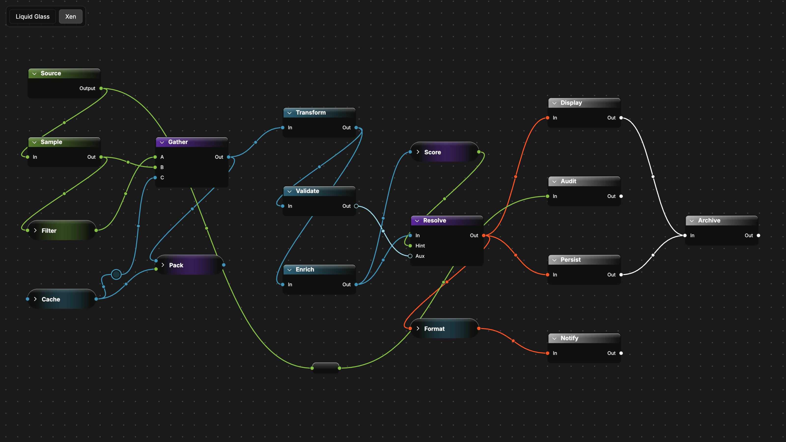
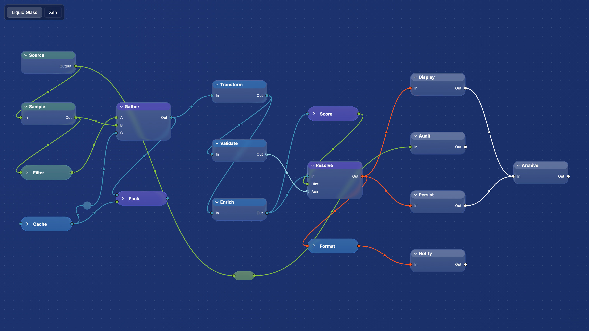

# XenolithGraph

An embeddable, drop-in node-graph editor for the web with a polished design system inside the package — and a swappable theme architecture that lets you replace the renderer's material entirely, not just its palette.

> **Status:** pre-v0.1. Public API is stabilising. v0.1 release follows the Liquid Glass shader landing + mobile support.

<p>
  
  
</p>

## What it does

```ts
import { XenolithEditor } from '@xenolith/editor'

const editor = await XenolithEditor.init('#app')
editor.addNode(myNode, { category: 'logic', title: 'Source' })
editor.connect(a, 0, b, 1, { sourceType: 'float' })
```

One call boots: fonts, PIXI v8 renderer (WebGL/WebGPU auto-selected), viewport, grid, pan/zoom, marquee selection, multi-drag with snap-to-grid, connect-pins-by-drag, Alt+drag rewire, collapsible nodes with animated pill form. Headless core (graph + commands + undo/redo) is zero-dependency.

## Themes are first-class

A `XenolithTheme` bundles three things — `tokens` (the design-token tree), an optional custom `renderNode`, and an optional `createGrid` for the canvas backdrop. Themes swap at runtime through `editor.setTheme(theme)` and re-render every node in place; selection, hover, collapse state, and positions are preserved.

Two themes ship in the box:

### Xen — the default dark/gold material

Original Blueprint-influenced look: dark `#0F110E` node bodies, gold accents, category-tinted headers (`logic`/`data`/`macro`/`utility`), typed pins (`exec`/`data`, with type-color wires), counter-glow on hover/selected, animated collapse-to-pill. Lives in `@xenolith/theme-xen`.

### Liquid Glass — Apple WWDC25-style frosted shader

Custom PIXI v8 Mesh + GLSL material that *actually sees through* the canvas: per-frame backdrop snapshot, SDF rounded-rect with edge-localised refraction along the outward normal, 13×13 gaussian blur on the sampled backdrop, vertical gradient tint, bright luminous rim. Sits over a radial-gradient navy canvas with the same dot grid. Lives in `@xenolith/theme-liquid-glass`.

Switching is one line:

```ts
import { xenTheme } from '@xenolith/render-pixi'
import { liquidGlassTheme } from '@xenolith/theme-liquid-glass'

editor.setTheme(liquidGlassTheme)   // instant — every node re-rendered, state preserved
editor.setTheme(xenTheme)
```

The shader-heavy backdrop pass is **opt-in per theme** (`theme.needsBackdrop`) — Xen pays zero extra render cost; Liquid Glass turns it on automatically.

## What's wired up in v0.1

- **Editor lifecycle:** `XenolithEditor.init('#app')` — single async call.
- **Theming:** runtime `setTheme()`, per-theme `renderNode` / `drawEdge` / `createGrid` hooks, deep-merge token overrides.
- **Interaction:** pan, zoom (mouse wheel, focal), marquee, multi-select, group-drag with snap (anchor-based — relative offsets preserved), Alt to disable snap.
- **Pins & edges:** connect by drag (with live ghost edge + type-compat validation), Alt+drag a connected pin to detach and reroute, Esc / drop-in-void to snap the original back, fan-in capacity enforced per `pin.multiple`.
- **Nodes:** collapse/expand with animated pill form, pin labels reposition along the rounded end-caps.
- **Headless core:** mutable Graph + readonly views, CommandBus with `apply/undo`, cascading edge removal on node removal.

## What's coming

| When | What |
|---|---|
| v0.2 | Keyboard shortcuts (Delete / Cmd+Z / Cmd+D), JSON serialise/load (`xenolith.v1.json`), NodeSchema + Tab palette, real ComfyUI workflow importer |
| v0.3 | **Full mobile / touch support** — two-finger pan + pinch-zoom, finger-sized pin hit-areas (already in the renderer), tap-to-tap pin connect mode, long-press multi-select. No competitor handles tablet well today. |
| v0.4 | Framework adapters (`@xenolith/react`, `…/vue`, `…/svelte`), minimap, comments, reroute nodes |
| Later | Pixel-art shader theme (third built-in material), collaborative editing |

## Packages

| Package | Role |
|---|---|
| `@xenolith/core` | Headless graph model, commands, selection, event emitter — zero runtime deps |
| `@xenolith/render-pixi` | PIXI v8 renderer, the `XenolithTheme` interface, `xenTheme`, geometry math |
| `@xenolith/editor` | Wires core + renderer + interaction. The public entry point |
| `@xenolith/theme-xen` | Default Xen design tokens, bundled Inter fonts, font loader |
| `@xenolith/theme-liquid-glass` | Liquid Glass theme — radial backdrop + GLSL mesh material |

## Develop

```sh
pnpm install
pnpm --filter @xenolith/playground dev     # localhost:5173, includes a theme switcher
pnpm test                                   # vitest across all packages
pnpm build                                  # tsc -b across all packages
```

## License

MIT.
